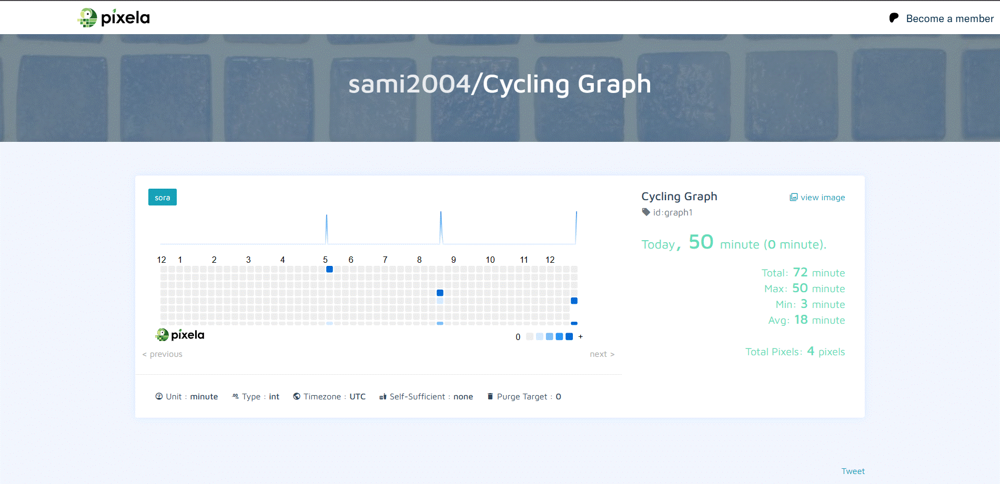

# Habit Tracker (Pixela API) – Python

## Overview

A simple **habit and activity tracking tool** built using Python and the Pixela API.

## Description

The script records daily activity data, updates or deletes entries, and visualizes progress on an online graph using API requests.

## Demo

