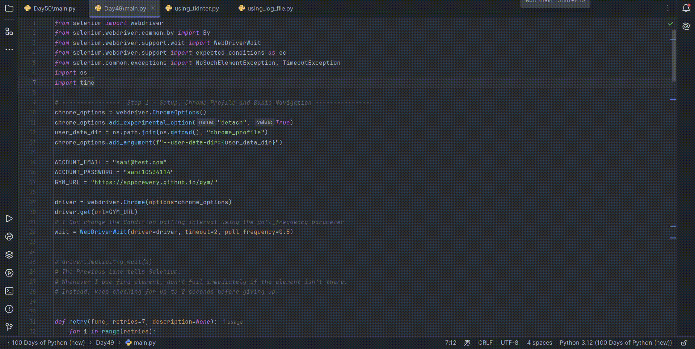

# Gym Class Booking Automation (Python)

## Overview

An automated **gym class booking system** built using Python and Selenium.

## Description

The script logs into a gym website, automatically books or waitlists specific classes based on day and time, and verifies all bookings to ensure they were successfully processed.

## Demo

