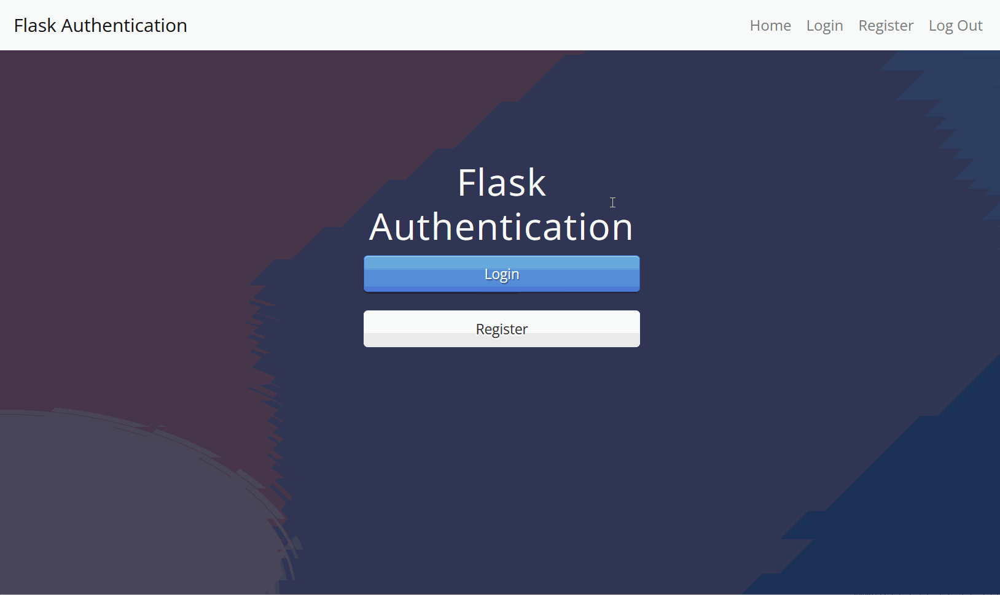

# User Authentication System (Flask)

## Overview

A Flask web application implementing user registration and login functionality.

## Description

This project allows users to register, log in, and access protected pages using session-based authentication.  
It demonstrates secure password hashing, user management with SQLAlchemy, and route protection using Flask-Login.

## Demo

