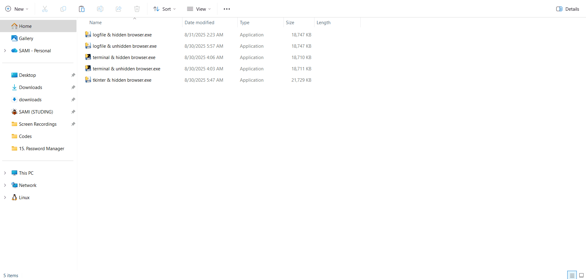

# PythonAnywhere Task Expiry Bot (Python + Selenium)

## Overview

An automation bot that logs into PythonAnywhere and extends scheduled task expiry automatically.

## Description

This project uses Selenium to log into a PythonAnywhere account, navigate to the tasks page, and extend task expiry when available.  
It supports headless execution, logging to a file, optional desktop notifications using Tkinter, and can be packaged as a standalone executable.

## Demo

